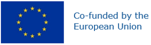

# INCODE @Context Server

This Flask-based application serves JSON-LD context files over HTTP.  
Its purpose is to provide the `@context` definitions required by NGSI-LD entities used in the apps hosted on the repositories referenced in the [Related Repositories](#5-related-repositories) section.

## 1 Features

- Serves multiple JSON-LD context files through HTTP endpoints
- Supports NGSI-LD semantic definitions for sensor payloads and derived features
- Lightweight Flask-based application
- Can be run locally with Python or deployed using Docker

## 2 Prerequisites

- Python 3.x
- Flask
- Waitress

## 3 Available Context Endpoints

The application exposes the following context files:

- `/emg1000.jsonld`
- `/emgFeatures.jsonld`
- `/polarACC.jsonld`
- `/polarECG.jsonld`
- `/polarHR.jsonld`
- `/ngsi-context.jsonld`
- `/ngsi-context-canism-uc1.jsonld`
- `/ngsi-context-canism-uc2.jsonld`

By default, the server runs on port `5051`.

## 4 Run locally

Clone the repository:

```bash
git clone https://github.com/danish123117/INCODE-AtContextServer.git
cd INCODE-AtContextServer
pip install -r requirements.txt
python server.py
```

The server will be accessible at:

```text
http://localhost:5051
```

Example endpoints:

```text
http://localhost:5051/emg1000.jsonld
http://localhost:5051/emgFeatures.jsonld
```

Alternatively you can build and run it with Docker:

```bash
docker build -f dockerFile -t incode-at-context-server .
docker run -d -p 5051:5051 --name incode-at-context-server incode-at-context-server
```

## 5 Related Repositories

- **Biosignals-LD-2** -  
 `https://github.com/danish123117/bioSignals-LD-2`

- **Biosignals-LD** -  
 `https://github.com/danish123117/bioSignals-LD`

## 6 Acknowledgement

This work was carried out within the framework of the project **P2CODE**, funded by the **European Union** under **Grant Agreement No. 101093069**.
<p align="left">
  
</p>

## 7 Disclaimer

Views and opinions expressed are however those of the author(s) only and do not necessarily reflect those of the European Union or or the European Commission. Neither the European Union nor the European Commission can be held responsible for them.

## 8 MIT License

This project is licensed under the MIT License. See the [LICENSE](LICENSE) file for details.
